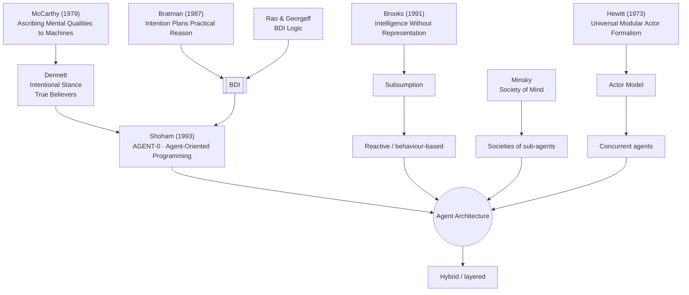

# Agent Architecture

The internal computational organisation of an agent — deliberative (BDI), reactive (subsumption), layered, or hybrid — along with the control loop and data pipelines that realise it.

## In this vault
- [[The BOID Architecture]]
- [[Intelligent Agents Theory and Practice]]
- [[Agent-Oriented Programming]]

## Architectural lineage

Papers: [[A Universal Modular Actor Formalism for Artificial Intelligence]] · [[Ascribing Mental Qualities to Machines]] · [[Intelligence Without Representation]] · [[The Society of Mind]] · [[True Believers - The Intentional Strategy and Why It Works]] · [[AGENT-0]]
