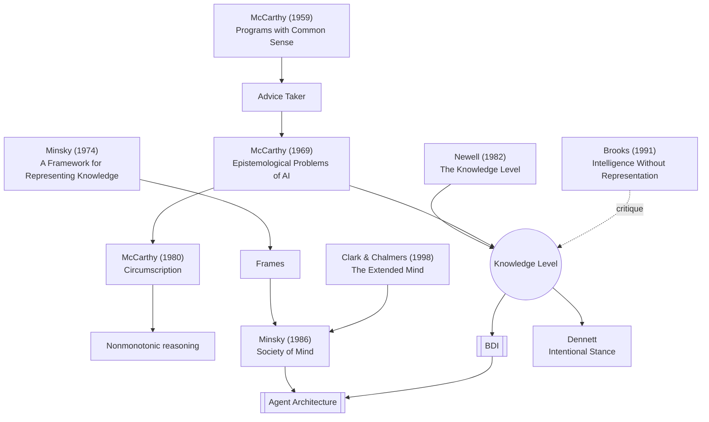

# Knowledge Level

Newell: a level of system description above the symbol level, in which behaviour is explained by what the system *knows* and *wants* (principle of rationality) — the theoretical home of agent theory.

## In this vault
- [[The Knowledge Level]]
- [[Symbol Level]]
- [[Principle of Rationality]]
- [[BDI]]

## Knowledge-representation lineage

Papers: [[Programs with Common Sense]] · [[A Framework for Representing Knowledge]] · [[Circumscription - A Form of Nonmonotonic Reasoning]] · [[The Knowledge Level]] · [[The Society of Mind]] · [[Intelligence Without Representation]] · [[The Extended Mind]] · [[Epistemological Problems of Artificial Intelligence]]
