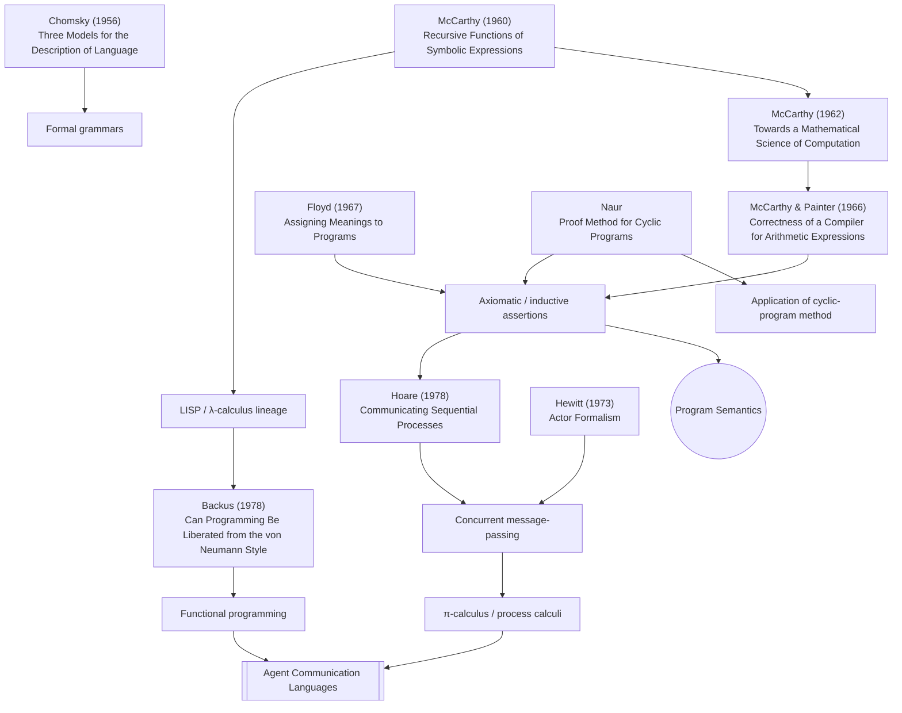

## Program Semantics

The mathematical definition of what a program means — operational (how it runs), denotational (what value it computes), or axiomatic (what properties it guarantees). Verifiable ACL semantics require programs whose meaning is pinned down precisely enough for conformance to be checked.

## In this vault
- [[Verifiable Semantics for ACLs]]
- [[Operational Semantics]]
- [[Hoare Logic]]

## Language, semantics, and concurrency lineage

Papers: [[Three Models for the Description of Language]] · [[Recursive Functions of Symbolic Expressions and Their Computation by Machine]] · [[Towards a Mathematical Science of Computation]] · [[Correctness of a Compiler for Arithmetic Expressions]] · [[Assigning Meanings to Programs]] · [[A Proof Method for Cyclic Programs]] · [[An Application of a Method for Analysis of Cyclic Programs]] · [[Communicating Sequential Processes]] · [[Can Programming Be Liberated from the von Neumann Style]] · [[A Universal Modular Actor Formalism for Artificial Intelligence]]
