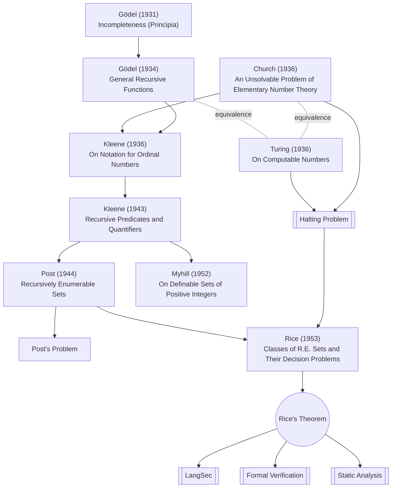

# Rice's Theorem

A foundational result in computability theory (Henry Gordon Rice, 1951–53): **every non-trivial semantic property of the partial function computed by a program is undecidable**. Source paper: [[Classes of Recursively Enumerable Sets and Their Decision Problems]]. "Non-trivial" means the property holds for some computable functions but not others; "semantic" means it depends on the input/output behaviour, not on the syntactic form of the program.

Put differently: you cannot in general decide, by inspecting a program, whether it belongs to any interesting class defined by *what it does*. Halting is one such property ([[Halting Problem]]), but so is "produces output X on input Y," "terminates for all inputs," "implements function f," "contains no unreachable states," and so on.

Rice's theorem is the formal frontier against which static-analysis, verification, and capability-bounding claims must be measured. Any tool promising to decide a non-trivial semantic property on arbitrary programs is — by Rice — either restricting the program class (e.g. [[Finite-state Grammars]], typed or total subsets) or approximating (sound-but-incomplete analyses). Whole research programs — [[LangSec]], [[Formal Verification]], [[Static Analysis]], [[Weird Machine]] — are organised around this constraint.

Concrete implication cited in [[House on Rock - LangSec in Ethereum Classic]]: Ethereum's gas mechanism cannot "sidestep Turing completeness" to deliver a safety guarantee, because safety is a semantic property and Rice's theorem makes semantic properties of arbitrary programs undecidable. Gas is a *resource bound* (non-semantic, decidable) masquerading as a *safety property* (semantic, undecidable).

## Connections
- [[Halting Problem]]
- [[Computability]]
- [[Universal Turing Machine]]
- [[Formal Verification]]
- [[Static Analysis]]
- [[LangSec]]
- [[Weird Machine]]
- [[Security Applications Of Formal Language Theory]]
- [[The Halting Problems of Network Stack Insecurity]]
- [[House on Rock - LangSec in Ethereum Classic]]

## Computability lineage

Papers: [[Über formal unentscheidbare Sätze der Principia Mathematica und verwandter Systeme I]] · [[General Recursive Functions of Natural Numbers]] · [[An Unsolvable Problem of Elementary Number Theory]] · [[On Notation for Ordinal Numbers]] · [[Recursive Predicates and Quantifiers]] · [[Recursively Enumerable Sets of Positive Integers and Their Decision Problems]] · [[On Definable Sets of Positive Integers]] · [[Classes of Recursively Enumerable Sets and Their Decision Problems]] · [[Extensions of Some Theorems of Gödel and Church]]

## Tags
#computability #undecidability #foundational #langsec #verification
