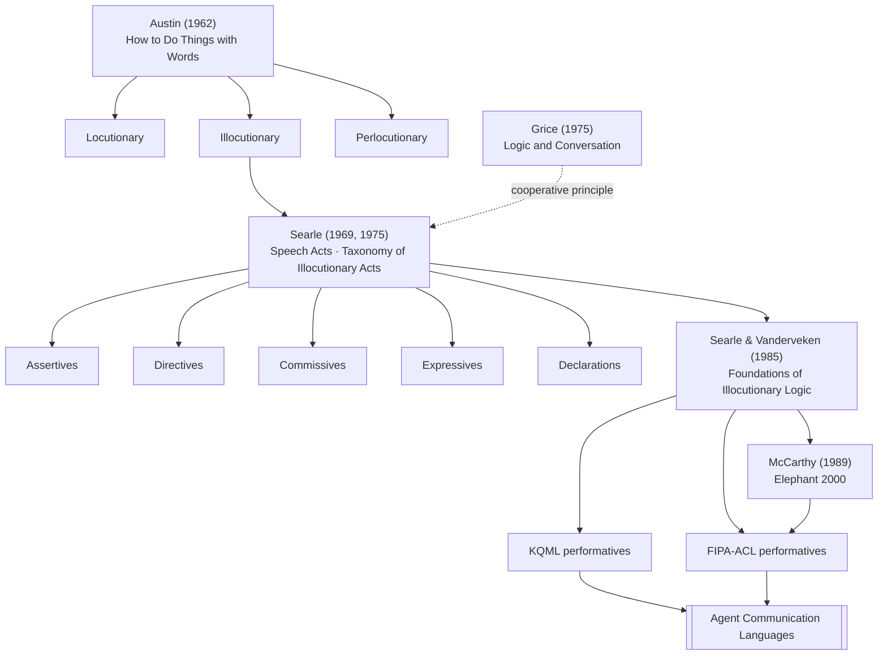

# Speech Act Theory

Philosophy-of-language framework (Austin, Searle, Vanderveken) in which utterances perform actions (illocutionary acts) — the semantic backbone of most [[Agent Communication Languages]].

## Sources
- [[Foundations Of Illocutionary Logic]] — Searle & Vanderveken
- [[Three Models for the Description of Language]] — Chomsky, foundations
- [[Agent Communication And Institutional Reality]]

## Applied in
- [[KQML]]
- [[FIPA-ACL]]
- [[Verifiable Semantics for ACLs]]
- [[ACL Rethinking Principles]]

## Lineage

Papers: [[How to Do Things with Words]] · [[Speech Acts - An Essay in the Philosophy of Language]] · [[A Taxonomy of Illocutionary Acts]] · [[Logic and Conversation]] · [[Foundations Of Illocutionary Logic]] · [[Elephant 2000 - A Programming Language Based on Speech Acts]]
